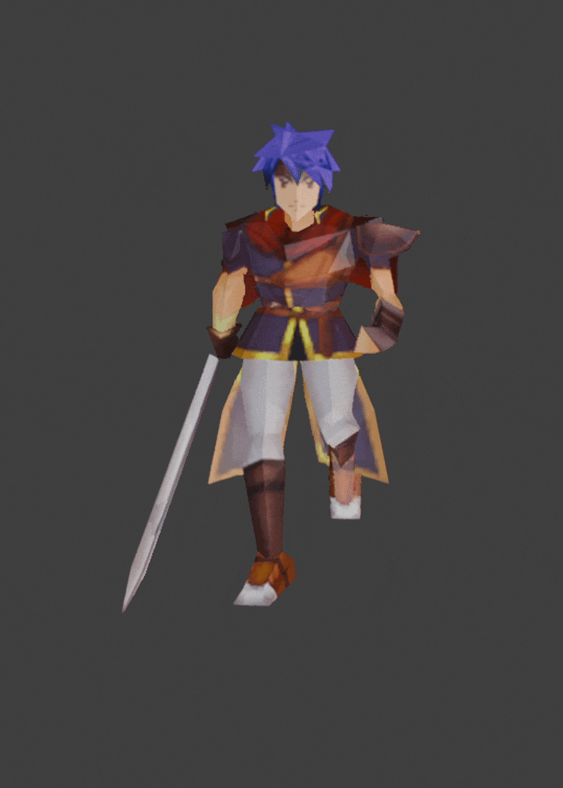

# Tellius Forge
A repository containing reverse-engineered research, documentation, and Blender tooling for assets from the Fire Emblem Tellius games (GC/Wii):
- Fire Emblem: Path of Radiance (FE9 / 蒼炎の軌跡)
- Fire Emblem: Radiant Dawn (FE10 / 暁の女神)

  

## Current Features

- Import FE9/FE10 assets (body `.g`, skeleton `.gs`, and animation `.ga` files)
- Export FE9/FE10 assets
- Modify body and skeleton assets
- Rename skeleton bones
- Modify animations
- Create custom animations
- Modify or add textures
- Reverse-engineered format documentation
  
## Repository Structure

Click to view Repository Structure

- [docs/](docs/) contains user-oriented guides.
- [research/](research/)  contains reverse-engineering notes, file format research, and technical findings
- [plugin/](plugin/)   contains main blender plugin.
- [tools/](tools/)  contains src code of auxiliary tools, organized by targeted asset. Necessary tools will be available as executables in [Releases](releases/)
- [images/](images/)    contains images organized by topic.

## Quick Start

1. Extract FE9/FE10 assets
2. Install Blender plugin
4. Import `.g` and `.gs` files
5. Edit body/skeleton
6. Export modified assets
7. Reinsert files into game archives

## Compatibility & Limitations

This project primarily targets overworld (`ymu/`) models and animations from FE9/FE10.

List of Supported/Unsupported Assets

#### Supported (working or mostly functional)
- Overworld `body.gs` and `skeleton.g` import/export. (extracted from `ymu/model*/pack.cmp`)
- Map object body `object*.gs` and skeleton `object*.g` import/export. (extracted from `zmap/map*/map.cmp`)
- Basic model editing and re-export.
- Texture workflow for supported models.

#### Partially supported
- Overworld animation `*.ga` import/export; compatibility varies depending on skeleton structure. (in `ymu/model*/` or extracted from `ymu/model*/pack.cmp`)
  - See [animation-compatibility.md](docs/animation-compatibility.md) for more info.
- Map object animation `object*.ga` import/export. (extracted from `zmap/map*/map.cmp`)
  

#### Not supported
- Battle Model body, skeleton, or animation import/export. (extracted from `zu/model/*.pak`)
- Effect animation `EID_*.ga` import/export. (extracted from `yme/EID_*.cmp`).

## Installation

Resources

    
1. [Blender](https://www.blender.org/download/) 4.2+ (tested using v5.0.1)
2. Current plugin available in [Releases](releases/) or [plugin/](plugin/tellius-forge.py)
3. [BrawlCrate](https://github.com/soopercool101/BrawlCrate)
4. [Lumina](https://github.com/thane98/lumina) by thane98
5. Additional python scripts in [tools/](tools/). Necessary tools will be available as executables in [Releases](releases/)
6. Optional: [ImHex](https://imhex.werwolv.net/) or any hex editor

Installing the Blender Plugin

1. In Blender, go to **Edit > Preferences > Add-ons**.
2. Click the dropdown arrow (**▼**) at the top-right and select **Install from Disk...**.
3. Navigate to `tellius-forge.py` and select it to install.
4. Search for "Fire Emblem" and check the box to enable.
5. The plugin adds new options under **File > Import** and **File > Export**.

## Documentation

Detailed workflows and tutorials are available in [docs/](docs/).

Recommended starting points:
- [Standard Workflow](docs/standard-workflow.md)
- Youtube Playlist: Tellius Forge Tutorials

## Credits
    
Asset analysis and the blender plugin are based on a [Noesis import plugin](https://github.com/Zheneq/Noesis-Plugins) created by [Zheneq](https://github.com/Zheneq). The source code was used and expanded with the original author's permission.

Initial conversion of the Noesis plugin into a Blender plugin by [ATMachine](https://github.com/ATMachine1).

This project substantially extends these works with:
- export support
- animation support
- improved skeleton imports
- additional format research

AI-assisted tools were used as a development aid for prototyping and asset analysis. All findings were verified through direct testing in Blender and in-game.

## License

This project is licensed under GPL-3.0.

The goal of this license is to ensure future forks and derivative tools remain open-source and accessible to the modding and preservation community.

## Disclaimer
This repository does not contain copyrighted Nintendo or Intelligent Systems assets.

Users are expected to legally obtain their own game files.
