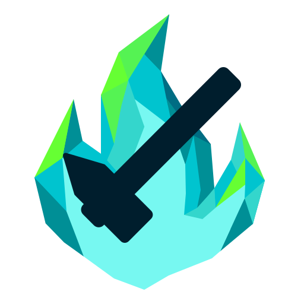

  

<h1 align="center">Tellius Forge</h1>

A repository containing reverse-engineered research, documentation, and Blender tooling for assets from Fire Emblem: Path of Radiance (FE9 / 蒼炎の軌跡) and Fire Emblem: Radiant Dawn (FE10 / 暁の女神)

  

## Current Features
- Import FE9/FE10 bodies, skeletons, and animations
- Export FE9/FE10 bodies, skeletons, and animations
- Edit FE9/FE10 bodies, skeletons, textures, and animations
- Retarget animations between compatible models
- Create custom animations
- Rename and modify skeleton bones
- Reverse-engineered file format documentation and research

## Documentation

Detailed workflows and tutorials are available in [docs/](docs/).

Recommended starting points for new users:
- [Quick Start Guide](./docs/README.md)
- [Getting Started](./docs/getting-started.md)
- Youtube Playlist: [Tellius Forge Tutorials](https://youtube.com/playlist?list=PL650N9tNdfYazuxS5b63BzaUKxZLErT0e)

## Compatibility & Limitations

This project primarily targets overworld (`ymu/`) models and animations from FE9/FE10.

List of Supported/Unsupported Assets

#### Supported (working or mostly functional)
- Overworld `body.gs` and `skeleton.g` import/export. (extracted from `ymu/model*/pack.cmp`)
- Map object body `object*.gs` and skeleton `object*.g` import/export. (extracted from `zmap/map*/map.cmp`)
- Basic model editing and re-export.
- Texture workflow for supported models.

#### Partially supported
- Overworld animation `*.ga` import/export; compatibility varies depending on skeleton structure. (in `ymu/model*/` or extracted from `ymu/model*/pack.cmp`)
  - See [animation-compatibility.md](docs/animation-compatibility.md) for more info.
- Map object animation `object*.ga` import/export. (extracted from `zmap/map*/map.cmp`)
  

#### Not supported
- Battle Model body, skeleton, or animation import/export. (extracted from `zu/model/*.pak`)
- Effect animation `EID_*.ga` import/export. (extracted from `yme/EID_*.cmp`).

## Installation

Requirements & Tools

1. [Blender](https://www.blender.org/download/) 4.2+ (tested using v5.0.1)
2. [Latest release of Tellius Forge](https://github.com/ltra043/tellius-forge/releases/latest). Source code also available in [plugin/](./plugin/tellius-forge.py) and [tools/](./tools/)
3. [BrawlCrate](https://github.com/soopercool101/BrawlCrate)
4. [Lumina](https://github.com/thane98/lumina) by thane98
5. Additional utility scripts in [tools/](tools/). Required tools are also available as Windows executables through [Releases](https://github.com/ltra043/tellius-forge/releases)
6. Optional: [ImHex](https://imhex.werwolv.net/) or any hex editor

Installing the Blender Plugin

#### For Windows Users (Simplest Method):  
1. Download the [latest release](https://github.com/ltra043/tellius-forge/releases/latest) of the Blender add-on `tellius-forge.py`. 
2. Download the necessary Windows executables `tellius-forge-toolkit.7z` and extract the contents.
    1. **Important!** Keep all contents of tellius-forge-toolkit.7z in the directories as they were packaged.

#### For Non-Windows Users (and Command-Line Users):  

Download the Tools & Source Code
1. Download the source code folders for the required tools: [ga_simple_edits](./tools/animation/ga_simple_edits) and [gs_texture_edits](.tools/body/gs_texture_edits).
2. Ensure you have Python installed on your system.

Install Dependencies
<ol type="1">
<li>Open your command-line terminal and navigate to the tool's directory: <code>cd /path/to/your/project</code></li>
<li><strong>Recommended:</strong> Create and activate a virtual environment:
    

    
macOS / Linux

    <ol type="i">
    <li>Create: <code>python3 -m venv venv</code></li>
    <li>Activate: <code>source venv/bin/activate</code></li>
    </ol>
    

    

    
Windows CMD

    <ol type="i">
    <li>Create: <code>python -m venv venv</code></li>
    <li>Activate: <code>venv\Scripts\activate.bat</code></li>
    </ol>
    

    

    
Windows PowerShell

    <ol type="i">
    <li>Create: <code>python -m venv venv</code></li>
    <li>Activate: <code>.\venv\Scripts\Activate.ps1</code></li>
    </ol>
    

</li>
<li>Install required packages using:
    <ol type="i">
    <li><strong>macOS / Linux:</strong> <code>python3 -m pip install -r requirements.txt</code></li>
    <li><strong>Windows:</strong> <code>python -m pip install -r requirements.txt</code></li>
    </ol>
</li>
</ol>

#### All Users Blender Add-on Installation
1. In Blender, go to **Edit > Preferences > Add-ons**.
2. Click the dropdown arrow (**▼**) at the top-right and select **Install from Disk...**.
3. Navigate to `tellius-forge.py` and select it to install.
4. Search for "Fire Emblem" and check the box to enable.
5. The plugin adds new options under **File > Import** and **File > Export**.

## Repository Structure

Click to view Repository Structure

  
Tellius Forge  
├─ [docs/](docs/)      User guides  
├─ [research/](research/)  Reverse engineering notes  
├─ [plugin/](plugin/)    Blender add-on  
├─ [tools/](tools/)     Utility scripts  
└─ [images/](images/)    Documentation images  

## Credits
    
Asset analysis and the Blender add-on are based on a [Noesis import plugin](https://github.com/Zheneq/Noesis-Plugins) created by [Zheneq](https://github.com/Zheneq). The source code was used and expanded with the original author's permission.

Initial conversion of the Noesis plugin into a Blender plugin by [ATMachine](https://github.com/ATMachine1).

This project substantially extends these works with:
- export support
- animation support
- improved skeleton imports
- additional format research

AI-assisted tools were used as a development aid for prototyping and asset analysis. All findings were verified through direct testing in Blender and in-game.

## License

This project is licensed under GPL-3.0.

The goal of this license is to ensure future forks and derivative tools remain open-source and accessible to the modding and preservation community.

## Disclaimer
This repository does not contain copyrighted Nintendo or Intelligent Systems assets.

Users are expected to legally obtain their own game files.

## Related Search Terms

  
Click to Expand

  Fire Emblem Path of Radiance (FE9), Fire Emblem Radiant Dawn (FE10), Tellius, Tellius modding, Tellius asset editing, 
  
  model editing, animation editing, Blender, Blender importer/exporter, skeleton editing, animation retargeting, 3D Modeling, 3D Models

  GameCube reverse engineering, Wii reverse engineering, game asset research, file format documentation, file format reverse engineering, 3D model formats, animation formats, asset extraction, asset import/export.

  Japanese:
  ファイアーエムブレム 蒼炎の軌跡,
  ファイアーエムブレム 暁の女神,
  蒼炎の軌跡 改造,
  暁の女神 改造,
  モデル編集,
  モーション編集
  

