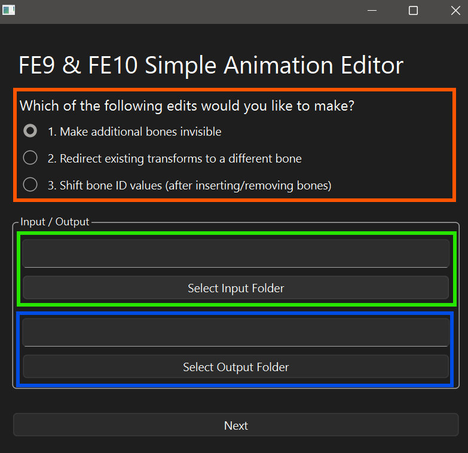
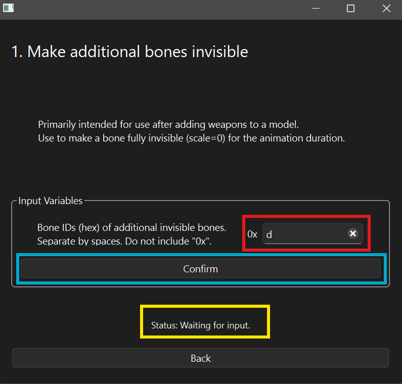
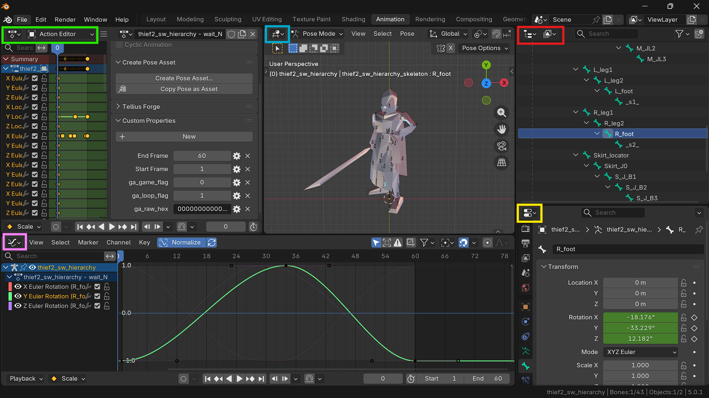
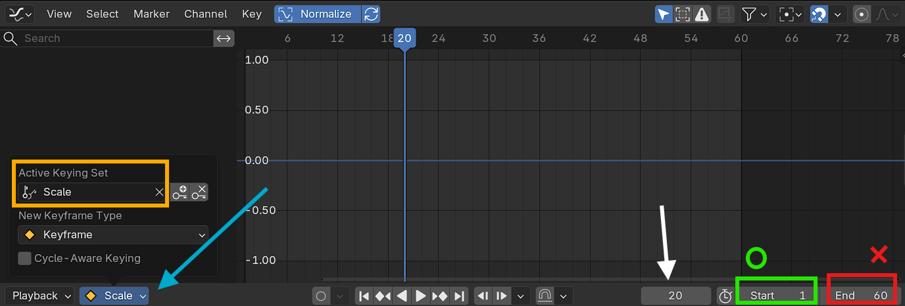
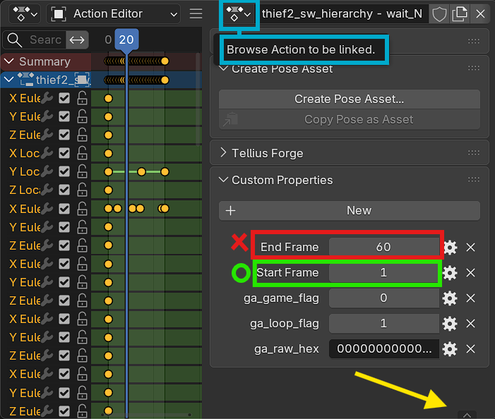
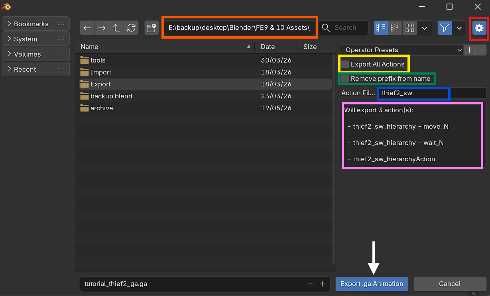

<h1 align=center> Animation Weapon Visibility Edits </h1>

<p align="center"><i>
Basic animation (in)visibility editing using hex editing, Blender, or Tellius Forge Toolkit.<br>
<a href="https://youtu.be/A7ClSwN3J7A">See Video Tutorial</a></i><br>
</p>

<p>
<b>Author:</b> Jade (ltra043)<br>
<b>Date:</b> 2026-06-23<br>
<b>Version:</b> <code>Tellius Forge v0.2.0</code><br>
</p>


## Reader Information

<details>
<summary>Table of Contents</summary>

1. [Identify Weapon Bone IDs](#1-identify-weapon-bone-ids)
2. [Make Bone(s) Invisible Using Tellius Forge Toolkit](#2-make-bones-invisible-using-tellius-forge-toolkit)
3. [Make Bone(s) Invisible Using Blender](#3-make-bones-invisible-using-blender)
4. [Make Bone(s) Invisible Using a Hex Editor](#4-make-bones-invisible-using-a-hex-editor)
5. [Sort Animation Data](#5-sort-animation-data)
6. [Testing Modified Animations](#6-testing-modified-animations)

</details>

<details>
<summary>Resources & Requirements</summary>

1. [Tellius Forge] (Blender Addon & Toolkit)
   - Non-Windows users may need to download and use the source code and assets at [ga_simple_edits/]
2. [Lumina] by thane98
3. [ImHex] or any hex editor
   - Only needed if you choose to hex edit animations
4. [Video Tutorial](https://youtu.be/A7ClSwN3J7A)

Optional / Recommended:
1. [Skeleton Analyzer]: Summarizes skeleton data, including provision of a table of bone IDs and bone names.
2. [Body & Skeleton Workflow]
3. [Youtube Tutorial Playlist]
4. [Tellius Animation File Format]
5. [Tellius Skeleton File Format]
6. Programmer Calculator or any hex calculator
7. Notepad++, Notepad, or any note-taking tool

</details>

### Goals: 
- Make addon weapon invisible in existing animations
- Make original weapons invisible in new weapon animations


### Prerequisites
This guide is written for the scenario where you have added new weapon mesh and bones to a model and want to update the model's animations. 

Before following this guide, you should already have modified assets as outlined in [Body & Skeleton Workflow]. 

This includes:

- Added the weapon mesh and weapon bone(s)
- Exported the modified body and skeleton
- If applicable, performed basic animation edits needed for compatibility with "Blender Hierarchy" bone order
- Verified the model imports correctly into Blender
- Verified the model functions correctly in-game

### About Scale Transforms

Tellius animations do not always contain a dedicated visibility track. Instead, visibility is often controlled by bone scale. Setting a bone's scale to 0 makes the associated mesh invisible; setting scale back to 1 restores normal visibility (and size).

Although this guide focuses on weapon visibility, the same techniques can be used to add or modify scale animation data for any bone.

### Choosing a Method

There are 3 methods to update bone visibility. Pros and cons are listed for each option in their individual written sections. The options are listed from most to least recommended.
1. **[Using Tellius Forge Toolkit](#2-make-bones-invisible-using-tellius-forge-toolkit):** simple, fast, minor chance of error, nothing learned but little to misunderstand 
2. **[Using Blender](#3-make-bones-invisible-using-blender):** simple,  slow-ish, almost no chance of error, easy to understand
3. **[Using a Hex Editor](#4-make-bones-invisible-using-a-hex-editor):** complex, slowest, high chance of error, teaches the most about the hex format

---

## 1. Identify Weapon Bone IDs
For every method, you will need to know the bone ID of bones you want to make invisible. This can be looked up using Blender, the [Skeleton Analyzer] Python script, or a hex editor.


### 1.1 Identify Weapon Bone IDs in Blender (recommended):
All mentioned downloads and reference materials are linked in [Resources & Requirements](#reader-information).

1. Download `tellius-forge.py` from the latest release of [Tellius Forge].
2. Install the Blender Addon `tellius-forge.py`. See the [Getting Started] guide for detailed installation instructions.
3.  Go to **File > Import > FE9/FE10 Body + Skeleton (.gs + .g)**. Import your modified body+skeleton.
4. Select the armature and enter **Pose Mode**
5. Select a weapon bone. This should be the main bone that influences a weapon mesh.
   1. If you are unsure which bones to select, move the bones to see which influences only the weapon mesh you are interested in. 
   2. OR return to **Object Mode**, select the mesh, enter **Edit Mode**. Browse the Vertex Groups to find the one containing all relevant weapon vertices. The bone should have a matching name.
6. Open **Bone Properties** and locate the **Custom Properties** tab at the bottom.
7. Find the property named **fe_bone_index**. This is a decimal value also known as **bone ID**. 
8. Note the **bone name** and **bone ID** of all main weapon bones.
   1. You do not need to remember the bone IDs for children bones which control none or part of a weapon mesh. **Only bones which influence the entire weapon mesh.**

### 1.2 Identify Weapon Bone IDs from Skeleton Analyzer
You must have **Python installed**. You also need to **know the names of the bones you wish to target**. If you do not meet these conditions, follow steps to [Identify Weapon Bone IDs in Blender](#11-identify-weapon-bone-ids-in-blender-recommended).

All mentioned downloads and reference materials are linked in [Resources & Requirements](#reader-information).

1. Download the [Skeleton Analyzer] Python script. 
2. Open a command-line terminal.
3. To see more information, run the help command:
`python "/path/to/g-skeleton-analyzer.py" -h`
4. To analyze a skeleton file, run:
`python "/path/to/g-skeleton-analyzer.py" "path/to/skeleton.g"`
5. An output `.md` analysis summary will be written to the same directory as the input skeleton.
6. Open the `.md` analysis. There will be a table that, among other fields, lists bone IDs and bone names.
7. Locate the names of all main weapon bones. Note the names and bone IDs (hex).
   1. You do not need to remember the bone IDs for children bones which control none or part of a weapon mesh. **Only bones which influence the entire weapon mesh.**


### 1.3 Identify Weapon Bone IDs from Hex Editor
This is the **least recommended option**. I only include it so you might understand a little more about the skeleton data structure. This should be a last resort, if using Blender and Python are not available options.

1. Open your skeleton in a hex editor.
2. Enable ASCII interpretation. This typically shows as a column on the right of the hex data.
3. Jump to the end of the file to the String Pool. This is where you will begin to see legible text in english in the ASCII column.
4. The first string is typically `[unknown]`, terminated by `0x00`. 
5. The first bone name is the next null-terminated string. Common names are `all`, `root`, or `*_locator`. This is the first bone, with `bone_id` = `0x00`.
6. Every succeeding bone adds `+0x01` to `bone_id`.
7. Find the name of each bone you wish to target and determine it's bone ID. 

---

## 2. Make Bone(s) Invisible Using Tellius Forge Toolkit
**Preference:** high  
**Pros:** fast, simplest option  
**Cons:** (small) chance of error, requires viewing skeleton in Blender or a hex editor  

**About:** 
This is the **simplest and fastest** option. It should take a maximum of few minutes.

You will need to know the bone ID of bones you want to make invisible. This can be looked up using Blender, a hex editor, or the [Skeleton Analyzer] Python script.

All mentioned downloads and reference materials are linked in [Resources & Requirements](#reader-information).

### 2.1 Download & Install

1. Download the latest release of [Tellius Forge].
   - Non-Windows users may need to download the source code, assets, and modules at [ga_simple_edits/]
   - `ga-simple-edits.exe` and `ga_simple_edits.py` are considered equivalent programs. Swap out mention of the `.exe` for `.py` in instructions if using the script. 
2. Extract all from `tellius-forge-toolkit.7z`
3. **IMPORTANT!** The app `ga-simple-edits.exe` and the folder `assets/` must be kept in the same directory. Do not rename `assets/` or any files inside. 
4. Install the Blender Addon `tellius-forge.py`. See the [Getting Started] guide for detailed installation instructions.

### 2.2 App Start Page

<p align="center" style="font-size: 14px;">
  
  <br>
  <em><b>
  Image 1: Start page of ga-simple-edits UI </b><br>
  Orange (top): Editing Options<br>
  Green (center): Input Folder Path<br>
  Blue (bottom): Output Folder Path 
  </em>
</p>

1. Run `ga-simple-edits.exe`.
2. **Select from the Edit Options.** To make a bone invisible, choose **option 1**.
3. **Provide an input folder path.** Input the path to the folder holding animations you want to modify. The app will edit all animations nested within this folder.
   - Remember that for skeletons modified with "Blender Hierarchy" bone order, you should have already modified animations to account for shifted bone IDs. These **updated animations should be your input** for this edit.
4. **Provide an output folder path.** 
   - I recommend **choosing a separate output folder**, unique from the input folder. This leaves your original animations intact in case anything goes wrong.
   - Choosing the same input and output path will overwrite files (if standard animation names are used).
5. Press **Next**.

### 2.3 Provide Invisibility Edit Info

<p align="center" style="font-size: 14px;">
  
  <br>
  <em><b>
  Image 2: Page 1 ("Invis") of ga-simple-edits UI</b><br>
  Green (top): Important note about next steps (sorting data)<br>
  Red: Bone IDs Textbox<br>
  Blue (center): Confirm button<br>
  Yellow (bottom): Status Text 
  </em>
</p>

1. Input the **hex value** of the bone ID you want to make invisible in the central **Bone IDs Textbox**.
2. Press the **Confirm** button to edit animations.
3. The **Status Text** updates with a timestamp after writing the output animations.

---

## 3. Make Bone(s) Invisible Using Blender
**Preference:** medium  
**Pros:** good visual display, little to no chance of error, simple  
**Cons:** slow  

**About:** 
This is a **simple option** where it is easy to **visually understand** what you are doing. There is almost **no chance of error**. This option is **slower than using the toolkit app**, though not as slow as hex editing. 

### 3.1 Import Model & Animations

All mentioned downloads and reference materials are linked in [Resources & Requirements](#reader-information).

1. Install the Blender Addon `tellius-forge.py`. See [Getting Started] for detailed installation instructions.
2. Go to **File > Import > FE9/FE10 Body + Skeleton (.gs + .g)**. Import your modified body + skeleton. 
3. **Apply the Armature:** Select the mesh and open **Modifier Properties**. Duplicate the armature modifier and apply the duplicate. 
4. **Apply Pose as Rest Pose:** Select the armature and enter **Pose Mode**. Press **Ctrl+A** and select *Apply Pose as Rest Pose*.
   1. You should be familiar with the process in steps 3 and 4 from modifying models as outlined in the [Body & Skeleton Workflow] guide.
   2. Steps 3 and 4 are necessary before loading animations onto any armature.
5. Go to **File > Import > FE9/FE10 Animation (.ga)**. Import all animations that need to be modified.

### 3.2 Setup the Animation Workspace

<p align="center" style="font-size: 14px;">

<br>
<em><b>
Image 3: Animation Workspace</b><br>
1. Top Right (red): Outliner in View Layer mode (default)<br>
2. Bottom Right (yellow): Data Properties (default)<br>
3. Top Center (blue): 3D Viewport (default)<br>
4. Bottom Left (pink): Graph Editor<br>
5. Top Left (green): Dope Sheet in Action Sheet mode. Press N to open the right side panel.<br>
</em>
</p>

1. The top horizontal bar should list available workspaces such as `Layout`, `Shading`, and `Animation`. 
2. Click on `Animation` to switch to that workspace. By default, you should have 5 areas open. 
3. Open the editors listed in the **Image 3** caption and adjust the area sizes to your liking.
  
### 3.3 Setup Playback Controls

<p align="center" style="font-size: 14px;">

<br>
<em><b>
Image 4: Playback Controls</b><br>
Blue Arrow (left): Toggle Keyframe Settings Menu<br>
Yellow Box (left): Active Keying Set with 'Scale' selected<br>
White Arrow (right): Current Frame<br>
Green Box/Circle: Scene Start Frame<br>
Red Box/X: Scene End Frame
</em>
</p>

1. Use the **Playback Controls** footer menu in the **Action Sheet** or open it in the **Graph Editor**.
   1. **To view Playback Controls:** Press the small `^` arrow at the bottom of the **Action Sheet** or **Graph Editor**. See on **Image 5**, below.
2. In **Playback Controls**, click on the second menu button to expand **keyframe settings**. There is an orange diamond icon at the left of the menu button.
3. Set the **Active Keying Set** to `Scale` only.

### 3.4 Selecting an Animation

<p align="center" style="font-size: 14px;">

<br>
<em><b>
Image 5: Action Sheet UI</b><br>
Blue Boxes (top): Browse Action to be linked<br>
Red Box/X: End Frame from Animation Data<br>
Green Box/Circle: Start Frame from Animation Data<br>
Yellow Arrow (bottom): Toggle Playback Controls
</em>
</p>

1. Select an armature and switch between animations in the **Action Editor**. There is a dropdown select in the top menu. Use this to browse and select the action linked to the armature. 
2. When you switch animations, check the `Start Frame` and `End Frame` in the right panel's **Custom Properties**. 
   - Press **N** to toggle the right panel.
3. Update the Scene Start and Scene End Frames in the **Playback Controls** to match the custom properties. 
   1. See start and end frame fields on **Image 4** and **Image 5**.

### 3.5 Modifying Animations
1. Select the armature and enter **Pose Mode**.
2. Set the current frame to `0`.
3. Select the bone you want to make invisible. This should be the main weapon bone which controls the entire weapon mesh (and only that weapon mesh)
4. Delete any existing scale channels for this bone in the **Graph Editor** left panel. 
   1. Deleting existing scale channels prevents original animation data from overriding the visibility state you are trying to establish.
   2. If you are NOT making the bone invisible, do not delete these channels. Use your judgement on which keyframes you want to keep.
5. Hover your mouse in the **3D Viewport**.
6. Press **S**, **0**, and **Enter** to **set Scale X, Y, and Z to 0**.
   1. You can also change scale in **Bone Properties** in the **Transform** panel.
   2. To change a bone from invisible (scale=0) to **standard visible**, set the **Scale XYZ = 1** using the **Transform** panel. 
7. Still hovering in the 3D Viewport, press **I** to insert a keyframe at the current frame (0) for Scale XYZ channels.
8. Continue for all animations you wish to edit.

### 3.6 Rename Actions
1. If you are **exporting all animations** in the scene, **name the actions as you wish** the exported `.ga` file to be named.
2. Do not use `.ga` in the name; it will be automatically appended.
3. **To export only some actions:** use a consistent partial string in the action names. You can search for the partial string match to filter which actions to export
   1. I recommend formatting action names as: `model* - motion*_WP*`. 
   2. For example: `thief2_sw - wait_SW`.

### 3.7 Export Animations

<p align="center" style="font-size: 14px;">

<br>
<em><b>
Image 6: Export Animations UI</b><br>
Red (top-right): Toggle Settings Panel<br>
Orange: Export Directory Path<br>
Yellow: Checkbox to Export All Actions in Scene<br>
Green: Checkbox to remove prefix from action names<br>
Blue: Search Filter Textbox<br>
Pink: List of Exported Actions<br>
White Arrow (bottom): Export Animations button
</em>
</p>

1. Go to **File > Export > FE9/FE10 Animation (.ga)**. 
2. Navigate to the directory you want to save your exported animation(s) in.
3. Select to export just the **single active action** (default), **export all actions**, or type in the textbox to **filter actions** to export.
4. Checking the **Remove prefix from name** option will remove prefixes from the action name. 
   - This attempts to standardize the exported animation name.
   - This works for action names following the format suggested above: `model* - motion*_WP*`
   - The example action named `thief2_sw - wait_SW` would be exported as an animation named `wait_SW.ga`
5. Click **Export .ga Animation** to export. 

---

## 4. Make Bone(s) Invisible Using a Hex Editor
**Preference:** low  
**Pros:** good for understanding the hex data format  
**Cons:** slowest option, error-prone, requires viewing skeleton in Blender or a hex editor  

**About:**  
This is the option I **least recommend**. It is **slow** and has **high likelihood of error**.  I will cover it because it demonstrates the same hex data changes the other two options make. The other options are faster and less involved.

This guide does not cover the hex data format in depth. See [Tellius Animation File Format] and [Tellius Skeleton File Format] for a detailed analysis.

1. Open an animation in a hex editor.
2. Find the **bone count** at byte 0x1F.
3. **Increase bone count** by the number of additional bones you want to make invisible (+0x01 if you added 1 weapon, +0x02 for 2 weapons, ...).

### 4.1 Bone Table Edits:
1. Follow the pointer at address `0x24` to the **start of Channel Data**. This is one byte after the **end of the Bone Table**.
2. Add a row of `0x10` bytes to the end of the Bone Table. Add one row for every bone you want to make invisible.
3. Bookmark or note the new start of **Channel Data**.
4. Update the pointer at `0x24` to the new start address of **Channel Data**.

**Update New Table Data**
1. **Column 1:** Input the **bone ID** of the bone you want to make invisible.
2. **Column 2:** Input `0x08`.
3. **Column 3:** Look at the row above. Add together the values in that row's **column3** and **column 4**. Input the resulting sum in the new row's column 3.
4. **Column 4:** Input `0x03`.
5. Repeat for every added row.


### 4.2 Channel Data Edits
1. Find the pointer at address `0x2C`. Add `0x10 * num_added_bones` to this value.
2. Follow the updated pointer. It should take you to the **start of F-Curve Data**.
3. For every additional bone you want to make invisible, **insert `0x24` bytes** before the start of F-Curve Data (i.e., at the end of Channel Data).
4. Bookmark or note the new start of **F-Curve Data**.
5. Update the pointer at `0x2C` to the new start address of **F-Curve Data**.

**Update New Channel Data Entries**
1. Copy and paste the following data over every inserted 0x24 bytes.
```
00 00 0F 00  00 00 00 01  00 00 EE E0
00 01 0F 00  00 00 00 01  00 00 EE E1
00 02 0F 00  00 00 00 01  00 00 EE E2
```
2. Find last entry's frame-related data.
   1. Find the last 4 bytes before the added data. This is the `last_frame_index`.
   2. Find the 2 bytes before `last_frame_index`. These 2 bytes are `last_frame_count`.
   3. Add together `last_frame_index` and `last_frame_count` to get the `next_frame_index`.
3. Update the last 4 bytes of each added `0x0C` byte entry.
   1. Replace `00 00 EE E0` with `next_frame_index`.
   2. Replace `00 00 EE E1` with `next_frame_index + 0x01`
   3. Replace `00 00 EE E2` with `next_frame_index + 0x02`

### 4.3 F-Curve Data Edits
1. Find the end of F-Curve Data.
   1. Check the first 4 bytes of the file. This is the **header pointer**. 
   2. If the **header pointer** value is 0, F-Curve Data is the last section of the file. Go to the end of F-Curve Data at the end of the file.
   3. If **header pointer** is non-zero, the value is a big-endian pointer.
   4. To update the pointer value,  add `(0x10 + 0x24) * num_added_bones` to this value. 

   *For FE9 Files:*
   1. Follow the pointer. It should now take you to 1 byte after the end of F-Curve Data.  
   
   *For FE10 Files:*
   1. Follow the updated pointer. This takes you to the **header pointer target**.
   2. If the 4-byte **header pointer target** value is 0x00, the **next 4 bytes** is a pointer called **footer pointer 1**.
   3. If the 4-byte **header pointer target** value is 0x05, the **last 4 bytes** is a pointer called **footer pointer 1**.
   4. Follow **footer pointer 1** as a big-endian pointer. This takes you to 1 byte after the end of F-Curve Data. 
2. For every new invisible bone, insert `0x0C` bytes after the last byte of F-Curve Data.
3. Leave all added bytes as `0x00`.

### 4.4 Update Header and Footer Pointers
1. Add `(0x10 + 0x24 + 0x0C) * num_added_bones` to all footer pointer values.
   1. If you need help identifying all footer pointers, read about the complex footer data structure in the [Tellius Skeleton File Format] research document.
2. Add `0x0C * num_added_bones` to the header pointer.

---

## 5. Sort Animation Data

### 5-1. Normal Sorting Patterns
If you used the **Tellius Forge Toolkit** or **Hex Edit** options to make bone(s) invisible, your added data is likely out-of-order. 

Animation data is typically sorted by:
| Data Type | Sorted by (ascending) |
|--------------|----------------------|
| Bone Table rows | Bone ID |
|Channel Data entries | Bone ID, Channel Type |
| F-Curve Data keyframes | Bone ID, Channel Type, Frame |

*When multiple sorted options are listed, they are listed in order. Data is sorted into large groupings and sorted by the next filter within those groupings* 

### 5-2. Sorting Modified Animation Data
While animations *might* function when out-of-order, they are more likely to display correctly when sorted. It is **best practice to sort animation data** before using it in-game, to reduce instability.

Additionally, if you tried to make a bone invisible which is already transformed in the transform data, **you MUST sort data to remove any clashing transform instructions**.

#### Sort Using Tellius Forge Toolkit
Use the `ga-simple-animation-edits.exe` or `ga_simple_edits.py` to sort animation data quickly. 

I do not recommend hex editing to sort the data, as it is easy to introduce errors.

1. Run `ga-simple-edits.exe`.
2. **Select from the Edit Options.** To sort animation data, choose **option 4**.
3. **Provide an input folder path.** Input the path to the animation or folder holding animations you want to sort. The app will edit all animations nested within a folder.
   - You do not need to provide an output path. This edit option overwrites files in place.
4. Press the "Run Sorting Edit" button.

---
## 6. Testing Modified Animations

1. Import animations onto your *animation-prepared model* in Blender to test they function as expected.
   1. *Animation-prepared* refers to instructions in [3.1 Import Model & Animations](#31-import-model--animations). These steps are necessary before loading animations onto any armature.
2. Verify the intended weapon appears or disappears correctly.
3. Play through the entire animation duration.
4. Confirm no other weapon meshes appear or disappear unexpectedly.
5. After checking in Blender, test animations in-game.

<!-- Links Start -->
[Tellius Forge]: https://github.com/ltra043/tellius-forge/releases/latest

<!-- Tools -->
[ga_simple_edits/]: ../tools/animation/ga_simple_edits/
[Skeleton Analyzer]: ../tools/skeleton/g_analyzer.py

<!-- Docs -->
[Getting Started]: ./getting-started.md
[Body & Skeleton Workflow]: ./body-skeleton-workflow.md

<!-- Research -->
[Tellius Animation File Format]: ../research/animation/tellius-animation-file-format.md
[Tellius Skeleton File Format]: ../research/skeleton/tellius-skeleton-file-format.md

<!-- Videos -->
[Video Tutorial]: https://youtu.be/hTaJZR31x1s
[Youtube Tutorial Playlist]: https://youtube.com/playlist?list=PL650N9tNdfYazuxS5b63BzaUKxZLErT0e

<!-- Other -->
[Lumina]: https://github.com/thane98/lumina
[ImHex]: https://imhex.werwolv.net/

<!-- Links End -->
