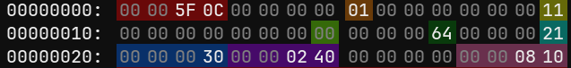
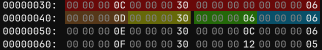
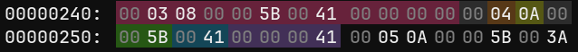
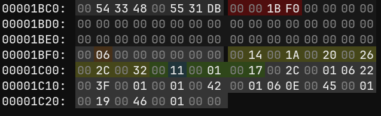
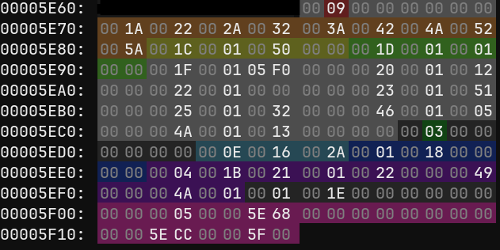

<h1 align="center">Tellius Animation File Format</h1>

<i>
Reverse-engineering notes on the format of Fire Emblem 9 and Fire Emblem 10 overworld animation (.ga) files </i>  
by Jade (ltra043)

Keywords

 Fire Emblem animation format, Fire Emblem animations, FE9 animation format, FE10 animation format, Path of Radiance animations, PoR Animations, Radiant Dawn animations, Tellius animation research, .ga format, GameCube animation format, Wii animation format, reverse engineering, file format documentation, skeleton animation data, F-curve animation data, animation reverse engineering, game asset research, 3D animation format, Nintendo GameCube modding, Nintendo Wii modding, GameCube Modding, GC Modding, GC/Wii Modding

## Additional Resources

1. FE9 [ImHex bookmarks](https://drive.google.com/file/d/1gEC-5amlmNdOrbVD1ffcL6yReEkhC1Zu/view?usp=drive_link) for `knight’s atk1_bw.ga`  
2. FE10 [ImHex bookmarks](https://drive.google.com/file/d/1R0Uo3316i4A9-4jWofwuXbDdNJDC2d2W/view?usp=drive_link) for fe10 `fighter3_n’s atk_2.ga` (handaxe)  
3. [ga-bookmark.py](.../tools/animation/ga-bookmark.py): creates **ImHex bookmarks** for animation files
4. [App for Tellius Unit Map Model Porting](https://github.com/ltra043/tellius-unit-model-ports) 
    - Currently supports FE10 to FE9 porting  
5. FE10 [ImHex bookmarks](https://drive.google.com/file/d/1wBQgxkHshERlykjIj5WD58jmAeRpy2Wl/view?usp=drive_link) for fe10 `fighter3_n’s skeleton.g`  
6. [Skeleton file viewer](https://docs.google.com/spreadsheets/d/1zbN7nSeyl0lY_XA7-t0zFUdaRjoDEF3c_laifMrM5Pc/edit?gid=1433193727#gid=1433193727&range=A1) : spreadsheet that parses and organizes skeleton data
7. [g-analyzer.py](.../tools/skeleton/g-analyzer.py): parses skeleton data and creates detailed summary
8. [How to port and edit ymu animation files - guide](https://docs.google.com/document/d/1oIBy46jQPswIIK-ls6cR9AbOMlFR7gbLdcyi7juQHbc/edit?usp=sharing)

---
## Research Status

**Legend:**
- **Confirmed** = verified through direct testing and file modification
  - Statements of fact, concluded from very strong patterns and/or in-game debugging
- **Strong evidence** = observed consistently across many files but not fully proven
  - May be based on strong but not always applicable patterns
  - May be based on a smaller sample size
  - May be very consistent but not yet confirmed in-game
  - Keywords: likely, seems, usually, corresponds
- **Hypothesis** = plausible interpretation requiring further validation. 
  - May be based on observations and trends from only a few samples. 
  - Untested or difficult to verify
  - Keywords: Possible, may be related to..., potentially, theorize

**Testing Scope:**
The following observations are based on comparison of `ymu` animations. They might not be true for EVERY animation. 
  - The format is likely similar for `zu` animations.
  - Effect animations in `yme` have much more data present. The format is the same until the Footer Data section. 
---
## General Structure & Brief Overview

There are 4 main sections and 1 optional section to every .ga file in the ymu folder. 

1. Organization / File Info  
2. Bone Table  
3. Channel Data  
4. F-Curve Data  
5. Footer Data (not included in every file)

Other Notes:

* All pointers are Big Endian pointers with no offset.   
    

**Organization / File Info**

* Bytes 0x00 - 0x2f  
* Defines the start/end frames of the animation.   
* Includes address markers / pointers for each of the other 4 sections.   
* Includes # rows in Bone Table  
* Includes other unknown but consistent data

**Bone Table:**

* 4-column table; 4 bytes per column
* Ties **bones from the skeleton.g** file to data in the Channel Data entries

**Channel Data:**

* Connects Bone Table entries to F-Curve Data  
* Defines **channel type** (transformation type), **scale factor**, last keyframe, # keyframes, and **starting index in F-Curve Data**  
* Organized in entries/chunks of **0x0c bytes**

**F-Curve Data:**

* Data which establishes F-Curve shape  
* Organized into **datasets** of varying size  
* Within a dataset, data is organized into 4-byte **keyframes**.
  * Keyframes are made of 2-byte pairs (frame, transformation value)

**Footer Data:**

* **Optional** last section  
* Can include up to 3 pointers  
* FE9: typically 0 or 1 pointer  
* FE10: typically 3 pointers; sometimes 0 or 1 pointer  
* Contains up to 3 sub-sections  
  * **Footer Pointers:** Pointers & related data  
  * **Footer Data 1:** *Damage & Effect timing.* Functions similarly in FE9 and FE10  
  * **Footer Data 2:** *Controls visibility.* Only present in some FE10 animations. Makes parts of the skeleton (usually unequipped weapons) invisible for all or part of the animation duration. 

---

## Detailed Overview

### Organization / File Info

  
   
  <em>Image 1: File Info bookmarks from FE10 fighter3_n atk_2.ga</em>

**Pointer to Footer Data Pointer(s)**

* Bytes 0x00 - 0x03 *(red) :*  
* If there is no footer data, the value is 00 00 00 00  
* **For FE9**: if there is footer data, this pointer **points directly to Footer Pointer 1** (there is only 1 Footer Pointer)  
* **For FE10:** if there is footer data, this pointer **points to 0x0c bytes before the end of the file**   
  * If there is Footer Data, there can be 1 or 3 Footer Pointers near EOF
  * More info in [Footer Data](#footer-data) section

**Bytes 0x04 - 0x0b**
* Bytes 0x004 - 0x07: `00 00 00 00`  
* Byte 0x08 *(orange)*: **Game Flag**
  * `00` for FE9
  * `01` for FE10   
* Bytes 0x09 - 0x0e: all `00`  
* Byte 0x0f *(yellow)*: `0x11`

**Playback Info**

* Bytes 0x10 - 0x13: **Loop Flag** 
  * `0x00000000` = no loop (default)  
  * `0x00000001` = loop (animation repeats)  
* Bytes 0x14 - 0x17: **start frame** of animation   
  * Usually only 1 byte at 0x17 *(light green)*. Remaining bytes are `00`  
  * **FE9:** usually `00` or `01`  
  * **FE10:** usually `00` or `01` EXCEPT for `motion*2_#.ga`   
  * Increasing this value can make an animation take less time by making the playback start later in the animation data.   
  * However, it needs to be **compatible with Footer Data 1**, or else the animation failsafe will trigger  
    * More detail in [Footer Data 1](#footer-data-1)  
* Bytes 0x18 - 0x1b *(dark green)* : **end frame** of animation  
  * Usually only 1 byte at 0x1b. Preceding bytes are `00`  
  * Decreasing this value can make an animation take less time by making it end earlier.   
  * However, it needs to be **compatible with Footer Data 1**, or else the animation failsafe will trigger  
    * More detail in [Footer Data 1](#footer-data-1)   
* Bytes 0x1c - 0x1f *(light blue)*: **number of entries (rows) in Bone Table  **
  * Usually only 1 byte at 0x1f. Other bytes are `00`

**Main Data Pointers**

Bytes 0x20 - 0x2f. Gives the **start address of each main data section:** Bone Table, Channel Data, and F-Curve Data 

* Bytes 0x20 - 0x23 *(dark blue)* : Pointer to the **start of Bone Table**   
  * Always `0x 00 00 00 30`  
* Bytes 0x24 - 0x27 *(purple)* : Pointer to the **start of Channel Data**  
  * Equal to 0x30 plus the size of Bone Table   
    * **Bone Table size** is the **product** of `[number of Bone Table data entries]` and `[0x10 bytes per entry]`  
* Bytes 0x28 - 0x2b: unknown, usually `0x 00 00 00 00`  
* Bytes 0x2c - 0x2f *(pink)*: Pointer to the **start of F-Curve Data**  
  * Equal to start of Channel Data plus size of Channel Data  
    * **Channel Data size** is equal to the **product** of `[number of Channel Data entries]` and `[0x0c bytes per entry]`   
    * *Number of Channel Data entries* is established in the Bone Table

### Bone Table

Ties bones from the skeleton.g file to sections of data in the Channel Data section. Establishes how many transformations a bone will undergo.

#### Related notes about skeleton.g

* See bookmarks for a skeleton file in [Additional Resources](#additional-resources).  
* After a **header** of size 0x10 bytes, data is organized into **244-byte (0xF4) Bone Records**.
* There is a **string pool** at the end of the file. The string pool is a **list of names for bones** in the skeleton.  
* The **last 4 bytes of every 244 byte entry** is a **relative pointer to the String Pool**. It tells the **index of the first letter of a string** in the String Pool (index count starts at 0 for the first character of [unknown]).  
* **Bone ID** is the *index of the full string in the string pool minus 0x01*.   
  * Skip the first string in the string pool, “[unknown]”. The next string, usually “all”, is at full string index = 0x00. Add 0x01 for the index of each following string.  
  * In each entry, the value at bytes 0xec-0xed = [Bone ID]*[0x10]  
  * Use the linked skeleton file viewer spreadsheet or [g-analyzer.py](.../tools/skeleton/g-analyzer.py) in [Additional Resources](#additional-resources) to determine a skeleton’s bone IDs  
* Animation files will use **bone ID in the Bone Table** to reference bones it wants to transform. 

#### Bone Table Composition

  
   
  <em>Image 2: Bone Table bookmarks from fe10 fighter3_n atk_2.ga</em>

* **Number of entries** is established by the file’s byte 0x1f  
* Each entry is **0x10 bytes** long  
  * See Entry 0x00 bookmarked in (*red)* in *Image 2*.  
* The table consists of 4 columns, each 0x04 bytes long  
* Column 1 *(orange)*: **Bone ID**  
  * Hex value of a bone ID that will be affected by animation transform(s)  
  * Rows are ordered by **ascending bone ID**. Animation may behave unexpectedly if rows are out of order.
  * **(In)visibility:** All bones in a skeleton are visible by default. If you want to make a bone invisible, you must include a scale transform to hide it.   
    * **FE9:** handled in **main data** (Bone Table, Channel Data, and F-Curve Data)
    * **FE10:** typically handled in **Footer Data 2**; sometimes in main data
* Column 2 *(yellow)*: **Channel Mask**  
  * Identifier for which of the 3, or combo of the 3, transform types a bone experiences  
  * `0x20`: Scale
  * `0x30`: Rotation 
  * `0x08`: Location
  * Add values together if multiple transform types occur.   
    * E.g., `0x38` is common for the hip bone, which involves both location and rotation  
  * **FE10:** Rarely involves Scale. Scale transforms are typically handled in **Footer Data 2**   
* Column 3 *(green)*: **Starting entry index in Channel Data**  
  * Channel Data can be divided into 0x0c-byte long entries  
  * Starts at index = 0 for the first entry  
  * This column tells which entry in Channel Data to start associating with the bone ID in the same table row  
  * This value is equal to the sum of values in column 4 for all rows before the current row  
* Column 4 *(blue)*: **Number of Channel Data entries**  
  * Tells how many entries in Channel Data are associated with the bone ID in the same Table row  
  * Common values: `01`, `03`, `04`, `05`, `06`, `09`

### Channel Data

This section provides **information about transformation channels** and **links Bone Table Data to F-Curve Data**. Data in this section can be split into **entries that are 0x0c bytes** long. The index of the first entry is 0x00. 

The number of entries is defined in the Bone Table. 

**\# Channel Data entries** = `{largest value in table column 3, usually in the last row}` + `{value in column 4 of the same row}`

#### Channel Data Entry Composition

  
   
  <em>Image 3: Channel Data bookmarks from fe10 fighter3_n atk_2.ga 
    
  Pink: Channel Data Entry 0x00 is 0x0c bytes long</em>

* Byte 0x00: `00`  
* Byte 0x01 *(orange)*: **Transform Channel Type**
  * Scale (X, Y, Z): `00`, `01`, `02`  
  * Rotation (X, Y, Z): `03`, `04`, `05`  
  * Location (X, Y, Z): `06`, `07`, `08`  
  * **Ordered by ascending Transform Channel Type** value within a set of entries associated with the *same bone ID* 
* Byte 0x02 *(yellow)*: **Precision Scale Factor**  
  * Scale factor used to **convert F-curve transformation value** into a float with minimal precision loss.   
  * Observations:  
    * This byte for weapons hidden the entirety of an animation is usually `0x0f`  
    * This byte for weapons hidden for part of an animation is usually `0x0e`  
* Byte 0x03: `00`  
* Bytes 0x04 - 0x05 *(green)*: hex value of the **last frame** for a transformation   
  * Most entries will have the same value as value File Info byte 0x1b, which is the last frame of the entire animation  
  * Some entries will have the same value as File byte 0x17, which is the first frame of the entire animation.   
    * This is typical for unused weapons, which are hidden at the start of the animation and never changed after that.   
* Bytes 0x06 - 0x07 *(blue)*: **number of key frames** in F-Curve  
  * Defines the size of F-Curve Data associated with each Channel Data entry  
  * There are 4 bytes per Keyframe in F-Curve Data  
* Bytes 0x08 - 0x0b *(purple)*: **index of starting keyframe** in F-Curve Data  
  * Index of the first entry is `0x00`

### F-Curve Data

Consists of **pairs of (frame, transform value)**, which build an animation data curve. Time measured in frames is along the X axis and transform is along the Y axis to build an f-curve graph.

**Transform values** are a signed 16-bit integer describing the **magnitude of the transformation**. They are effectively unitless and must be converted into values with meaningful units using the B2 Scale Factor values in Channel Data entries. 

**Each dataset in F-Curve Data varies in size according to # keyframes** (described in Channel Data). There are 4-byte entries for each keyframe. 

* Byte 0x00-0x01: **frame** (time)
* Byte: 0x02-0x03: **transform value**

>Note: the game reads bytes 0x00-0x01 as a 2-byte value representing frame. Functionally, the first byte is always `0x00` because there are no animations long enough to require values > `0xFF`. 

### Footer Data

Contains other info about the animation file. Can be divided into parts: Footer Data 1, Footer Data 2, Footer Pointer(s). 

- **Footer Pointer(s)** is organized differently in FE9 and FE10. 

- **Footer Data 1** exists in FE9 and FE10 animations where interaction with another unit could be expected. This includes attack, magic, critical, tackle, and move animations

- **Footer Data 2** only exists in some FE10 animations to control invisibility.

#### FE9 Footer Data

  
   
  <em>
  Image 4: Footer Data bookmarks from fe9 knight atk1_bw.ga 
  Red: Footer Pointer 1 [0x1bc8 - 0x1bcb] 
  Light Grey: Footer Data 1 [0x1bf0 - 0x1c27] 
  Other Bookmarks: See more in <a href="#footer-data-1">Footer Data 1</a>
  </em>

FE9 has either no Footer Data or Footer Data 1 + Footer Pointer(s)

* If the file’s bytes 0x00 - 0x03 has value `0x00`, there is **no Footer Data**. The file ends with F-Curve Data.   
* If the file’s bytes 0x00 - 0x03 has any **non-zero value**, there is **one Footer Pointer and Footer Data 1**  
  * The **header pointer** in bytes 0x00 - 0x03 **points directly to Footer Pointer(s)**.   
  * For FE9, Footer Pointer(s) contains a single 4-byte pointer that I call **Footer Pointer 1**. It is followed by 36 or 0x24 bytes of `0x00`
    > [!NOTE]
    > These 0x24 bytes are not always `0x00` in animations outside the `ymu/`. For example, effect animations in `yme/` often have additional pointers in this section.

  * **Footer Pointer 1** points to the start of Footer Data 1  
  * **Footer Data 1** lasts until the end of the file

#### FE10 Footer Data

FE10 has 4 possible combinations. 

1. No Footer Data  
2. Footer Data 1 + Footer Pointer(s)  
3. Footer Data 2 + Footer Pointer(s)  
4. Footer Data 1 + Footer Data 2 + Footer Pointer(s)

**No Footer Data**
* If the File bytes 0x00 - 0x03 has value 0x00, there is no Footer Data. The file ends with F-Curve Data. 

**Number of Footer Data sub-section(s)**
* If the File bytes 0x00 - 0x03 has any **non-zero value**, there is **Footer Data**  
* If the **last 4 bytes** of the file has a value of `0x00`, there is **only one Footer Data section**. It can be either Footer Data 1 OR Footer Data 2.  
* If the **last 4 bytes** of the file are any **non-zero value**, **both Footer Data 1 and Footer Data 2** are present. 

#### Identifying FE10 Footer Data sub-section(s)

  
   
  <em>Image 5: FE10 Footer Data bookmarks from fighter3_n’s atk_2.ga 
  Pink: Footer Pointers [0x5f00 - 0x5f17] 
  Other Bookmarks: See <a href="#footer-data-2">Footer Data 2</a> below</em>

* The pointer in File bytes 0x00 - 0x03 points to 0x0c bytes before the end of the file.   
  * The 4-byte pointer target has a value of either 0x00 or 0x05  
  * This value can serve as an identifier for a Footer Data sub-section  
  * If the value is 0x05, the next 4 bytes is a pointer to Footer Data 1  
  * If the value is 0x00, the next 4 bytes is a pointer to Footer Data 2  
* If there is only one Footer Data sub-section present  
  * Footer Pointer(s) is 0x0c bytes long. It consists of the Footer Identifier, a 4-byte Footer Pointer (1 or 2), and 4 bytes of 00  
  * The present Footer Data sub-section (1 or 2) starts at the value of the Footer Pointer (1 or 2) and ends at the Footer Identifier   
* If both Footer Data sub-sections are present (see *Image 5,* above):  
  * Footer Pointer(s) is 24 (or 0x18) bytes long  
  * Footer Pointer(s) contains 3 pointers and 2 pointer-identifiers  
  * The order of Footer Pointer data is: Footer Identifier 1, Footer Pointer 1, 4 bytes 00, Footer Identifier 2, Footer Pointer 2, Footer Pointer 3   
  * The first File pointer at 0x00 still points to 0x0c bytes before the end of the file  
    * The pointer target is the 4-byte Footer Identifier 2 with a value of 0x00  
  * Footer Pointer 2 points to the start of Footer Data 2.   
    * In *Image 5*, Footer Pointer 2 has a value 0x5ecc  
  * Footer Pointer 3 points to Footer Identifier 1 (which has a value of 0x05)  
    * The target of Footer Pointer 3 is typically 24 (or 0x18) bytes before the end of the file  
    * In *Image 5*, Footer Pointer 3 has a value 0x5f00  
  * The 4 bytes after Footer Identifier 1 is Footer Pointer 1. It points to the start of Footer Data 1  
    * In *Image 5*, Footer Pointer 1 has a value 0x5e68

#### Footer Data 1

  
   
  <em>
  Image 4: Footer Data bookmarks from fe9 knight atk1_bw.ga 
  Same as Image 4 above.
  </em>

**Footer Data 1** appears to identify important timing windows within an animation. This includes **attack, damage, and effect timing**.

**Footer Data Composition:**
* Byte 0x00: `0x00`  
* Byte 0x01 *(orange)*: **# entries** in Footer Data 1  
* Bytes 0x02 - 0x07: `0x00`  
* Bytes 0x08 - [variable end byte]  *(yellow)*: List of each Footer Data 1 entry’s **relative start index**.  
  * Each list item is 2-bytes, with the first byte being 00  
  * The second byte is the index of an entry’s starting byte.   
    * Index 0x00 is the very first `0x00` byte of the Footer Data 1.   
    * Index 0x01 is the # entries in Footer Data 1  
  * Size of the list is twice the number of entries (defined by Footer Data 1: Byte 0x01)  
* Bytes [variable start-end bytes]: **Entries**  
  * Starts after the list of start indexes  
  * Entries can **vary in size**   
  * First entry (Entry 0x00) in *Image 5* bookmarked in  (*green) .* 

Footer Data 1 Entry Composition: 
  * Byte 0x00: `0x00`  
  * Byte 0x01  *(blue)*: **frame**  
    * The frames used must be within the animation playback range of [start - end frame]. These values are defined at File Info bytes 0x17 and 0x1b  
  * The exact function of the remaining data is unknown.   
  * FE10 entries may have 2 extra bytes of 00 at the end of each entry compared to FE9  
>[!NOTE]
>At least one entry handles damage display. The start/end frames are limited by the frame assigned for the damage display.   
>  * The first animation frame (File Info bytes 0x14-0x17) must be smaller than the damage display frame.   
>  * The last animation frame (File Info bytes 0x18-0x1b) must be larger than the damage display frame.   
>  * There may be other limiting factors.
 

#### Footer Data 2

  
   
  <em>Image 5: FE10 Footer Data bookmarks from fighter3_n’s atk_2.ga 
  Same as Image 5 above. 
  Pink: Footer Pointers [0x5f00 - 0x5f17] 
  Light Grey: Footer Data 1 [0x5e68 - 0x5ecb] 
  Dark Grey: Footer Data 2 [0x5ecc - 0x5eff] 
  Other Bookmarks: See below 
  </em>

**Footer Data 2** is only present in some FE10 animations. It is **responsible for invisibility** (scale=0). This is used to hide bones and associated mesh for all or part of the animation.

**Footer Data 2 Composition**
* Overall layout is the same as Footer Data 1.   
  * **\# entries**  
    * Footer Data 1: *red*  
    * Footer Data 2: * dark green .*   
  * 0x06 bytes `0x00` padding  
  * **Relative address/start index of each entry:**   
    * Footer Data 1: *orange*   
    * Footer Data 2: *light blue*  
  * **Entry Data:**  
    * Footer Data 1, Entry 0x00:  *yellow .*  
    * Footer Data 1, Entry 0x01:  *light green .*  
    * Footer Data 2, Entry 0x00:  *dark blue .*  
    * Footer Data 2, Entry 0x01:  *purple .*  
* **Entry Data Composition:** 
  * Bytes 0x00 - 0x01: **number of keyframes**  
  * Bytes 0x02 - 0x03: **bone ID**
  * 4 bytes per Keyframe   
    * Bytes 0x04 - 0x05: **frame**  
    * Bytes 0x06 - 0x07: `00 00` or `00 01`  
      * `00` for invisible, `01` for visible  
  * Padding `00`s so the entry size is divisible by 4
